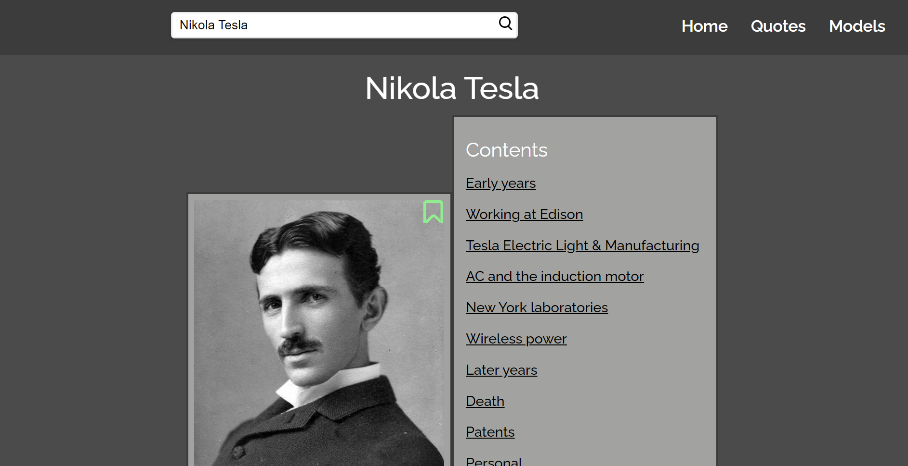
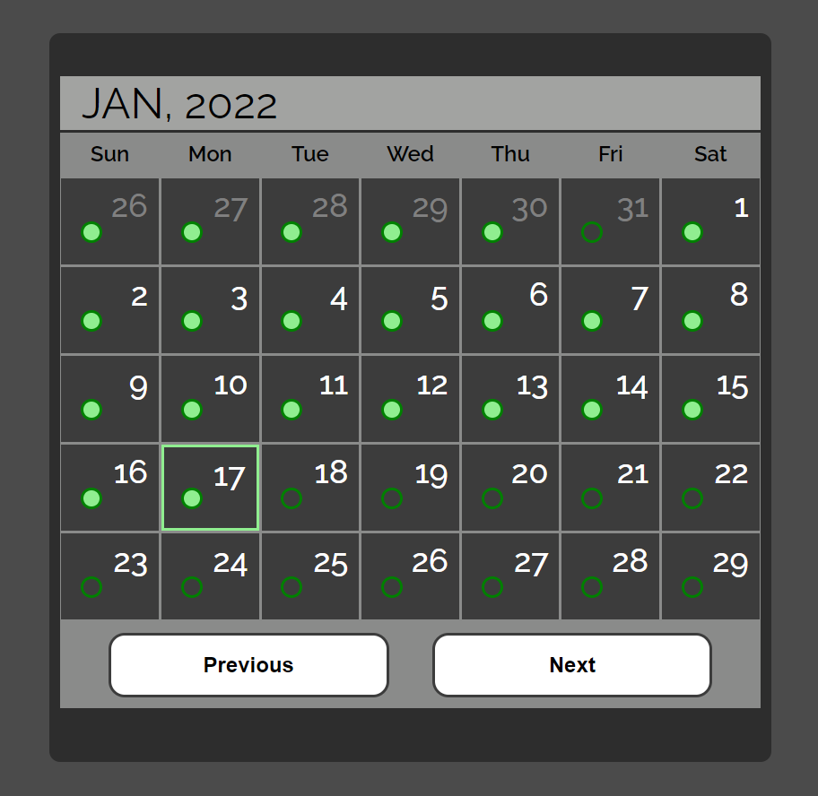

# Inspiro

## Screenshots

</img>
</img>

## Description

A JavaScript application to get you inspired to become the best verison of yourself

**Features:**

- Modern User Interface
- Intuitive Design
- Calendar Tracker
- Set Weekly Goals
- Discover Great People
- Daily Inspiring Quotes

## What I've Learnt

- Building a single-page-application (SPA)
- Managing complex state
- & much more

## Installation

To use this project, first clone the repo on your device using the command below:

`git init`

`https://github.com/tarwat-uddin/inspiro.git`

## License

[GNU General Public License version 3](https://opensource.org/licenses/GPL-3.0)
